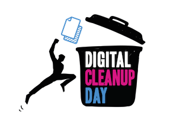

# Digital Cleanup Day — Bilan et Dashboard 2026

Ce projet est une plateforme web conçue pour collecter, consolider et visualiser les données d'impact du **Digital Cleanup Day 2026**. Elle permet aux organisateurs de déclarer leurs actions et de visualiser en temps réel l'impact environnemental (notamment les économies de CO₂) généré par l'événement à l'échelle nationale.

## 📋 Composants du Projet

Le projet s'articule autour de quatre piliers principaux :

### 1. Formulaire de Collecte (`index.html`)
Un formulaire interactif en trois étapes permettant aux structures (entreprises, associations, collectivités, écoles, citoyens) de saisir leurs résultats :
*   **Sensibilisation** : Webinaires, Fresques du Numérique, jeux pédagogiques.
*   **Réemploi** : Don, réparation et réutilisation d'équipements (ordinateurs, smartphones, tablettes).
*   **Données** : Suppression de fichiers (local/cloud), d'e-mails et d'applications.
*   **Recyclage** : Collecte de DEEE (Déchets d'Équipements Électriques et Électroniques).

### 2. Tableau de Bord National (`dashboard.html`)
Un outil de visualisation dynamique qui agrège les données remontées via Google Sheets :
*   **KPIs Généraux** : Nombre de Cleanups, participants totaux, audience sensibilisée.
*   **Impact CO₂** : Calcul automatisé des tonnes de CO₂ évitées grâce aux actions de nettoyage et de réemploi (basé sur les facteurs de l'ADEME).
*   **Analyses Graphiques** : Répartition par type de structure, distribution géographique, et comparaison Cloud vs Local.
*   **Top Contributeurs** : Mise en avant des structures ayant généré le plus d'impact.

### 3. Méthodologie (`methodologie.html`)
Une page dédiée explicitant les règles de calcul et les sources utilisées pour les estimations d'impact :
*   Détail des facteurs d'émission carbone.
*   Sources scientifiques (ADEME, INR).
*   Hypothèses de calcul pour le réemploi et le recyclage.

### 4. Vue Régionale (`regions.html`)
Une page permettant de filtrer et de visualiser les statistiques par région française et par pays limitrophes.

## 🛠️ Stack Technique

*   **Frontend** : HTML5, CSS3 (Vanilla), JavaScript (ES6+).
*   **Visualisation** : [Chart.js](https://www.chartjs.org/) pour les graphiques.
*   **Backend & Stockage** : Google Sheets via Google Apps Script (interfaçage via `fetch` API).
*   **Iconographie** : Emojis et logos personnalisés.
*   **Impact Environnemental** : Intégration interactive des équivalences via l'iframe de [ImpactCO2.fr](https://impactco2.fr).

## 🚀 Fonctionnement

1.  **Saisie** : L'organisateur remplit le formulaire sur `index.html`.
2.  **Envoi** : Les données sont envoyées vers un script Google Apps Script qui les enregistre dans une feuille de calcul maître.
3.  **Visualisation** : Le dashboard (`dashboard.html`) interroge la feuille de calcul via une API dédiée, traite les données en JavaScript et met à jour les indicateurs et graphiques instantanément.

---
*Ce projet est soutenu par l'Institut du Numérique Responsable (INR).*
